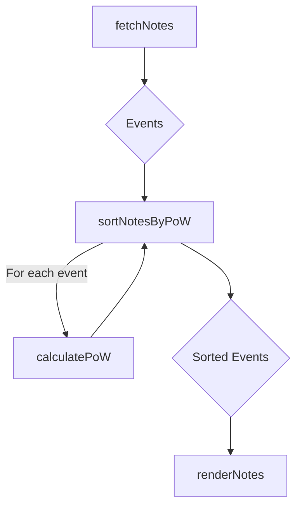

# PoW Calculation - High-Level Design

## 1. System Overview

The system fetches Nostr events and sorts them based on their Proof of Work (PoW) difficulty. This functionality is primarily handled within the `nostr-client.mjs` script.

## 2. Component Interaction

1.  **`fetchNotes()`**: Connects to Nostr relays and fetches a list of recent events.
2.  **`sortNotesByPoW(notes)`**: Takes the fetched events and sorts them in descending order of PoW difficulty.
3.  **`calculatePoW(event)`**: A helper function used by `sortNotesByPoW` to determine the PoW for a single event. This is the component being modified.
4.  **`renderNotes(notes)`**: Renders the sorted notes to the user interface.

## 3. API Definitions

No public-facing APIs are being changed. The internal function signature remains the same:

-   `calculatePoW(event)`:
    -   **Input**: A Nostr event object.
    -   **Output**: An integer representing the PoW difficulty (number of leading zero bits in the event ID).

## 4. Data Flow

## 5. Extensibility

The `calculatePoW` function is self-contained. Future NIPs that might alter the PoW calculation can be implemented by modifying this single function without affecting the rest of the system.